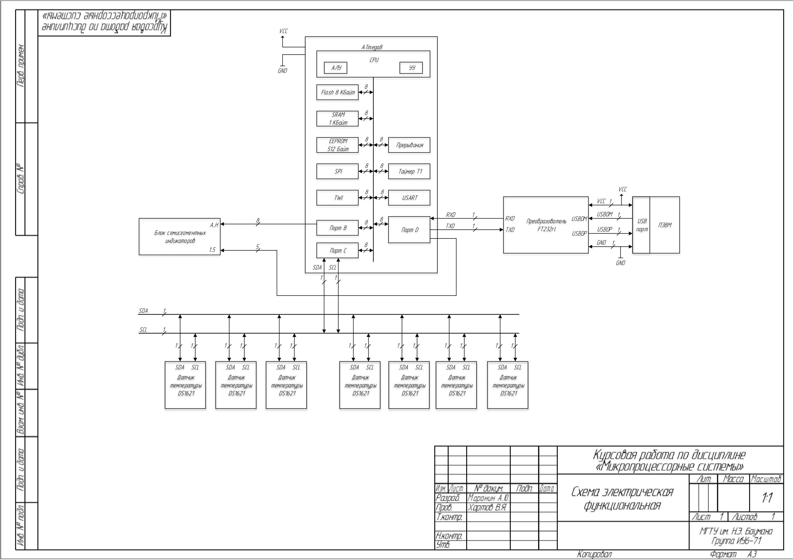
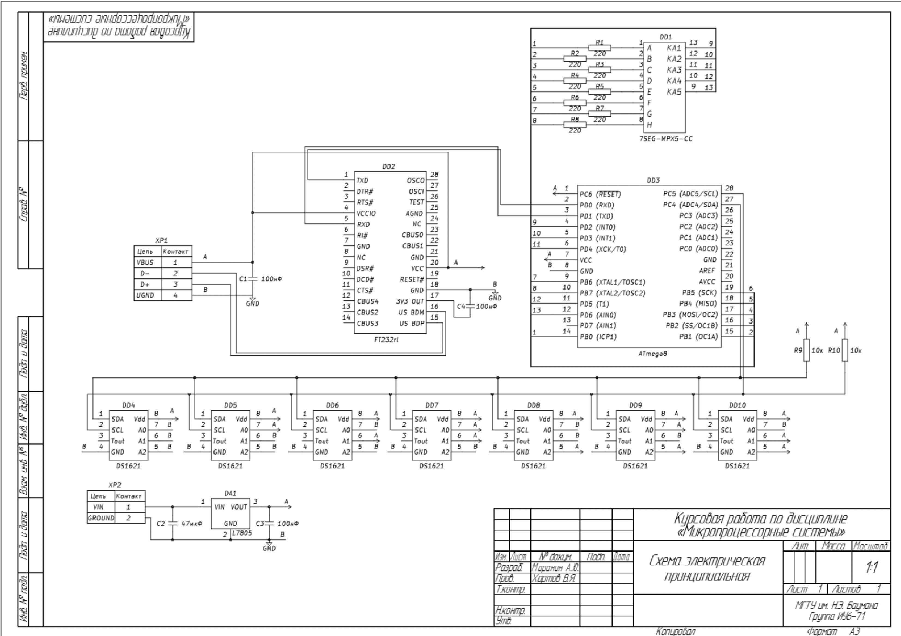
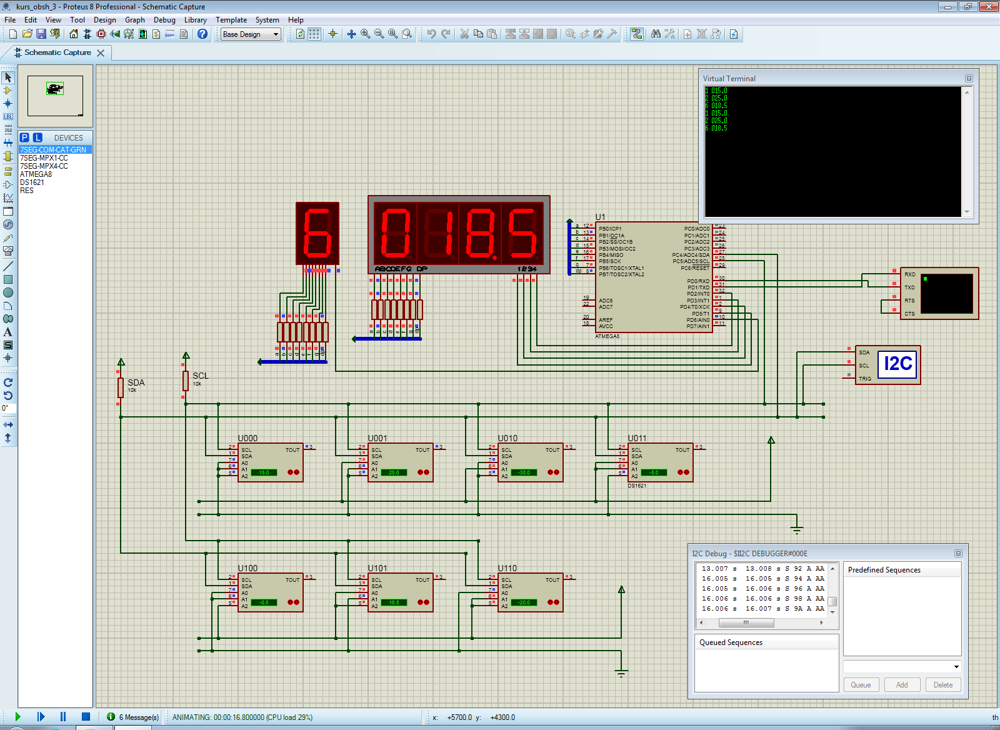

# Курсовая работа по курсу "Микропроцессорные системы"

## Задание
Разработать на основе микроконтроллера (например, ATmega8) регистратор температуры от 7-и цифровых датчиков типа DS1621 (или DS1821) по выбору. Сравнить показания датчиков с заданной температурой. Показания, превышающие пороговое значение, поочередно вывести на дисплей из 7-сегментных индикаторов, указав номер датчика и его показания, и переслать в ПЭВМ по последовательному каналу.

Разработать схемы, алгоритмы и программы. Отладить модули разработанной программы с помощью симулятора.

Оценить потребляемую мощность устройства.

<a href="docs/Задание.png">Фото задания</a>

## Результаты 

Был выбран микроконтроллер ATmega 8. Проект для микроконтроллера доступен в каталоге ```codevision_files```.

Симуляция проекта проводилась в САПР Proteus. Файл проекта доступен в каталоге ```proteus_project``` вместе с файлом-прошивкой для ATmega8: ```kurs_obsh_1.hex```.

### Расчетно-пояснительная записка, функциональная и принципиальные схемы
Расчетно-пояснительная записка и схемы доступны в формате PDF.

<b><a href="docs/РПЗ_Маранин_2017.pdf">Расчетно-пояснительная записка</a></b>

<b><a href="docs/Схема_функциональная.pdf">Схема электрическая функциональная</a></b>

<b><a href="docs/Схема_принципиальная.pdf">Схема электрическая принципиальная</a></b>


### Схема функциональная


### Схема принципиальная


### Пример работы
Пороговое значение устанавливалось с ПЭВМ через последовательный порт (USB) на уровне "10 °С".
